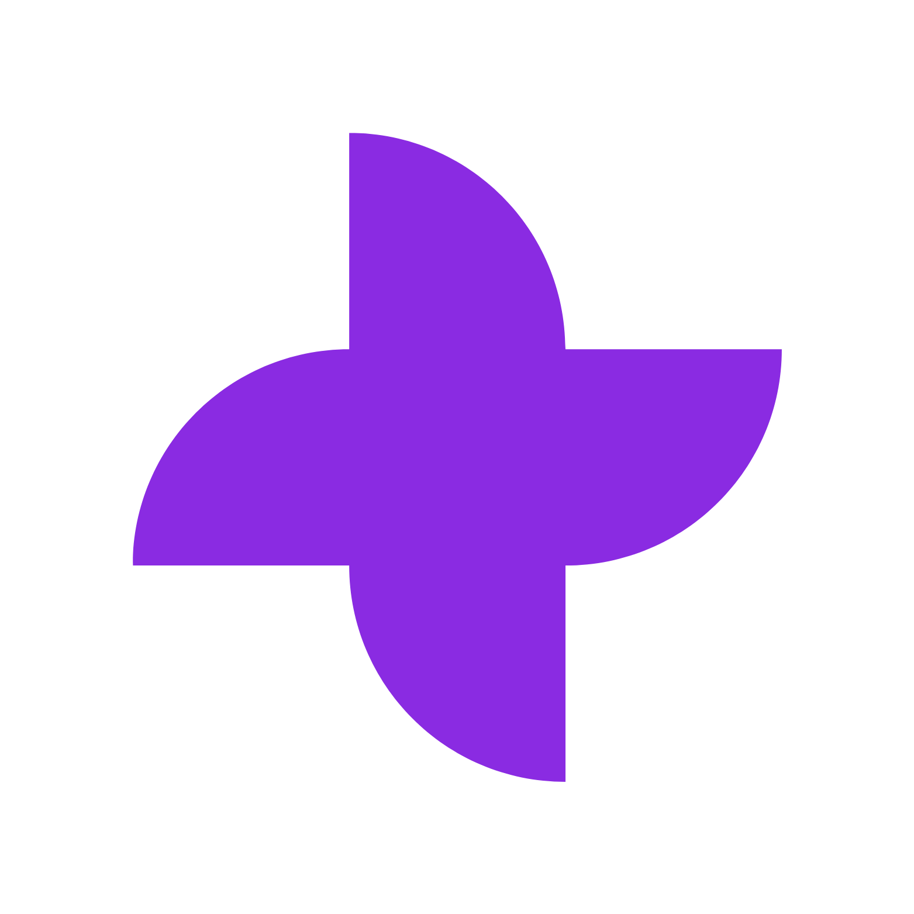
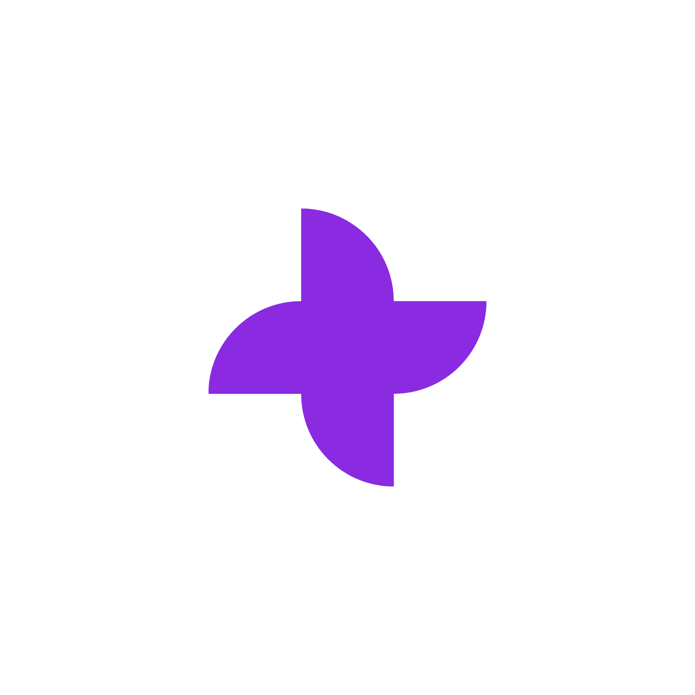
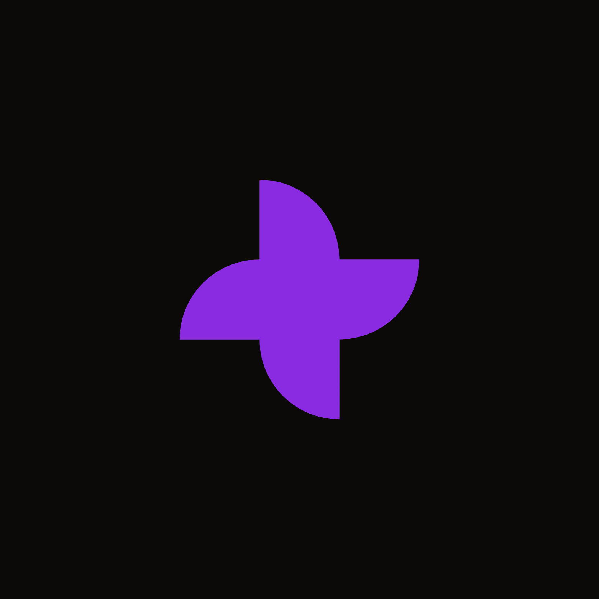

<h1>🍿 watchzone</h1>

<b>Your ultimate destination for discovering, tracking, and socializing around movies and TV series.</b>

watchzone is a full-stack web application built with the Next.js App Router, Prisma, and MongoDB. It leverages the TMDB API to provide a rich, interactive experience for movie and series enthusiasts. Users can browse, search, and manage their watchlists, follow other users, create custom playlists, and engage in discussions through a built-in commenting system.

✨ Features

🎬 Rich Media Browsing: Discover popular, top-rated, and trending movies and TV series.

🔍 Advanced Search: Instantly search for movies, series, and other watchzone users with autocomplete.

🔐 Authentication: Secure sign-up & sign-in with credentials (email/password) or social login (Google) via NextAuth.js.

❤️ Personalized Lists: Add any movie or series to your personal Favorites or Watchlist with a single click.

📋 Custom Playlists: Create an unlimited number of custom playlists (e.g., "Best Sci-Fi", "Weekend Marathon").

📺 Watch Now: Seamlessly watch movie/series trailers from YouTube or stream content directly via an embedded player.

👥 Social System: Follow and unfollow other users to see their activity and lists.

💬 Commenting System: Leave comments (and replies) on any movie or series detail page.

👤 User Profiles: View your own or other users' profiles, including their favorites, watchlists, and custom playlists.

🔧 Profile Customization: Change your username and upload a custom avatar using Cloudinary.

🛡️ Admin Panel: Dedicated admin page to manage users and assign roles (Admin, Verified).

🌓 Dark/Light Mode: Toggle between themes for your preferred viewing experience.

📈 SEO Optimized: Full SSR with Next.js and dynamic sitemap/metadata generation for high search engine visibility.

🖼️ Screenshots

<table width="100%">
<tr>
<td width="50%" align="center">
<b>Homepage & Hero Search</b>

</td>
<td width="50%" align="center">
<b>Movie Detail Page</b>

</td>
</tr>
<tr>
<td width="50%" align="center">
<b>User Profile Page</b>

</td>
<td width="50%" align="center">
<b>Top Rated List</b>

</td>
</tr>
</table>

🚀 Getting Started Locally

Follow these instructions to get the project up and running on your local machine.

1. Prerequisites

Node.js (v18.18.0 or later)

Git

MongoDB Atlas account (or a local MongoDB server)

TMDB API Key (v4 Read Access Token)

Google OAuth Credentials

Cloudinary Account

2. Clone the Repository

git clone [https://github.com/EVL44/watchzone.git](https://github.com/EVL44/watchzone.git)
cd watchzone

3. Install Dependencies

npm install

4. Set Up Environment Variables

Create a file named .env in the root of the project and add the following variables.

# ---------------------------------
# DATABASE (MongoDB)
# Get this from your MongoDB Atlas cluster
# ---------------------------------
DATABASE_URL="mongodb+srv://<user>:<password>@<cluster-url>/watchzone?retryWrites=true&w=majority"

# ---------------------------------
# NEXT-AUTH (Authentication)
# ---------------------------------
# A secret string for NextAuth.js (generate one here: [https://generate-secret.vercel.app/](https://generate-secret.vercel.app/))
NEXTAUTH_SECRET="YOUR_NEXTAUTH_SECRET"
NEXTAUTH_URL="http://localhost:3000" # Your local development URL

# Get these from your Google Cloud Console (OAuth 2.0 Client IDs)
GOOGLE_CLIENT_ID="YOUR_GOOGLE_CLIENT_ID"
GOOGLE_CLIENT_SECRET="YOUR_GOOGLE_CLIENT_SECRET"

# ---------------------------------
# TMDB API (Movie/Series Data)
# ---------------------------------
# Get this from The Movie Database (TMDB) API v4 settings
TMDB_API_TOKEN="YOUR_TMDB_API_V4_READ_ACCESS_TOKEN"

# ---------------------------------
# CLOUDINARY (Image Uploads)
# ---------------------------------
# Get this from your Cloudinary dashboard
NEXT_PUBLIC_CLOUDINARY_CLOUD_NAME="YOUR_CLOUDINARY_CLOUD_NAME"

# IMPORTANT: In your Cloudinary settings:
# 1. Go to "Settings" > "Upload"
# 2. Scroll down to "Upload presets"
# 3. Create a new preset
# 4. Set the "Signing Mode" to "Unsigned"
# 5. Set the "Preset name" to "kentar_avatars" (as specified in UploadWidget.jsx)
# 6. Set "Folder" to "kentar_avatars" (optional, but recommended)

# ---------------------------------
# ADMIN
# ---------------------------------
# The email of the user who should have Super Admin privileges
SUPER_ADMIN_EMAIL="your-email@gmail.com"

5. Set Up the Database with Prisma

Once your DATABASE_URL is set, run the following commands to sync your schema with the database.

# Pushes the schema to your MongoDB database (creates collections, etc.)
npx prisma db push

# Generates the Prisma Client based on your schema.prisma
npx prisma generate

6. Run the Development Server

You're all set! Start the app:

npm run dev

Open http://localhost:3000 in your browser to see the result.

🛠️ Tech Stack

Framework: Next.js 14 (with App Router & Server Actions)

Styling: Tailwind CSS

Authentication: NextAuth.js (Credentials & Google Provider)

Database ORM: Prisma

Database: MongoDB

API: TMDB for all media data

Image Uploads: Cloudinary

UI: React, Lucide Icons, next-themes

Made with ❤️ by EVL44

